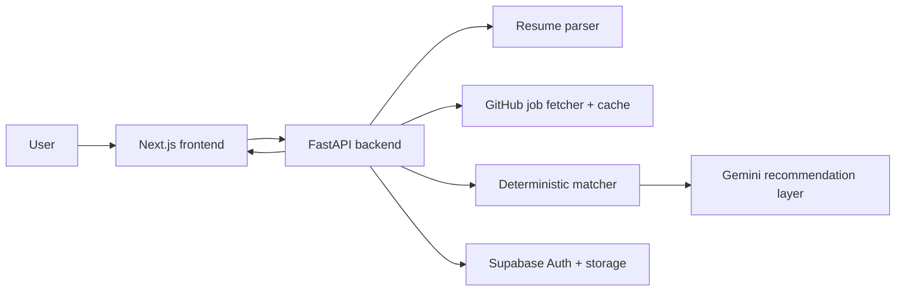

# JobFIT

JobFIT is a full-stack AI job-matching platform for students and early-career candidates. Users upload a resume, scan real internship and new-grad job feeds, rank opportunities by recruiter-style fit, and save the roles they want to apply to first.

The active production path is **Amplify frontend + Railway FastAPI backend + Supabase Auth/storage**. AWS deployment work is preserved in `legacy/deployment-experiments/` as reference material, but it is not the current default deployment path.

## Live Links

- Web app: https://main.d8rnzmcb1hxs.amplifyapp.com
- Backend API: https://jobfit-api-production.up.railway.app
- API health check: https://jobfit-api-production.up.railway.app/api/health

## What It Does

- Uploads PDF, DOCX, and TXT resumes with type and size validation.
- Extracts and normalizes resume text, then builds structured resume data: skills, projects, education, experience bullets, and keywords.
- Pulls jobs from SimplifyJobs and Jobright GitHub repositories.
- Caches job postings in SQLite locally or Supabase in production so scans can run faster.
- Ranks jobs using deterministic scoring: resume/job similarity, skill overlap, role fit, location preference, and posting freshness.
- Optionally uses Gemini only for recruiter-style recommendations, evidence-backed feedback, resume bullet suggestions, and final review of top candidates.
- Supports accounts, saved resumes, match runs, saved/applied/skipped jobs, and account/resume deletion.
- Keeps service-role Supabase access on the backend only.

## Architecture



## Active Repo Structure

```text
JobFit/
  app.py                         # tiny host shim for app:app platforms
  backend/                       # active FastAPI backend package
  frontend/                      # active Next.js app
  docs/                          # architecture, setup, security, file map
  infra/                         # active infrastructure config, when needed
  legacy/                        # archived old/experimental code
  tests/                         # active backend unit tests
  Dockerfile                     # Railway/container backend deploy
  Procfile                       # Procfile backend deploy command
  nixpacks.toml                  # Railway backend build config
  amplify.yml                    # Amplify frontend build config
  requirements-api.txt           # active backend dependencies
```

## Local Setup

Backend:

```bash
python3 -m venv .venv
source .venv/bin/activate
pip install -r requirements-api.txt
uvicorn backend.backend_api:app --reload --port 8000
```

Frontend:

```bash
cd frontend
npm install
NEXT_PUBLIC_JOBFIT_API_URL=http://127.0.0.1:8000 npm run dev
```

Local development uses `jobfit_local.db` unless Supabase environment variables are set.

## Environment Variables

Backend production variables:

```bash
SUPABASE_URL=https://your-project.supabase.co
SUPABASE_SERVICE_ROLE_KEY=your_service_role_key
SUPABASE_ANON_KEY=your_anon_or_publishable_key
SUPABASE_TABLE_PREFIX=jobfit_
JOBFIT_ENCRYPTION_KEY=your_fernet_key
JOBFIT_JOB_CACHE_TTL_MINUTES=360
GEMINI_API_KEY=your_gemini_key
ENABLE_GEMINI_RECOMMENDATIONS=true
FRONTEND_ORIGINS=https://main.d8rnzmcb1hxs.amplifyapp.com,http://localhost:3000,http://127.0.0.1:3000
```

Frontend production variables:

```bash
NEXT_PUBLIC_JOBFIT_API_URL=https://jobfit-api-production.up.railway.app
NEXT_PUBLIC_SUPABASE_URL=https://your-project.supabase.co
NEXT_PUBLIC_SUPABASE_ANON_KEY=your_anon_or_publishable_key
```

Generate a local encryption key with:

```bash
python3 -m pip install cryptography
python3 -c "from cryptography.fernet import Fernet; print(Fernet.generate_key().decode())"
```

## Job Sources

The default source is `All job repos`, which combines:

```text
SimplifyJobs/Summer2026-Internships README.md
SimplifyJobs/Summer2026-Internships README-Off-Season.md
SimplifyJobs/New-Grad-Positions README.md
jobright-ai/2026-Data-Analysis-New-Grad README.md
jobright-ai/2026-Software-Engineer-New-Grad README.md
jobright-ai/2026-Product-Management-Internship README.md
jobright-ai/2026-Software-Engineer-Internship README.md
jobright-ai/2026-Public-Sector-Internship README.md
```

The backend caches parsed postings per source. Set `JOBFIT_JOB_CACHE_TTL_MINUTES` to control refresh frequency.

## Testing

Backend:

```bash
python3 -m unittest discover -s tests
```

Frontend:

```bash
cd frontend
npm run build
npm audit --omit=dev
```

## Production Notes

- Use Railway for the FastAPI backend with `uvicorn backend.backend_api:app --host 0.0.0.0 --port $PORT`.
- Use Amplify for the Next.js frontend from the `frontend/` directory.
- Use Supabase Auth for production accounts. The backend still supports the old custom token flow as a compatibility fallback.
- Keep `SUPABASE_SERVICE_ROLE_KEY`, `GEMINI_API_KEY`, and `JOBFIT_ENCRYPTION_KEY` server-side only.
- Run `docs/supabase-schema.sql` in Supabase, keep RLS enabled, and do not grant direct table access to browser roles.

More detail is in `docs/architecture.md`, `docs/file-map.md`, `docs/production-readiness.md`, and `docs/environment.md`.
