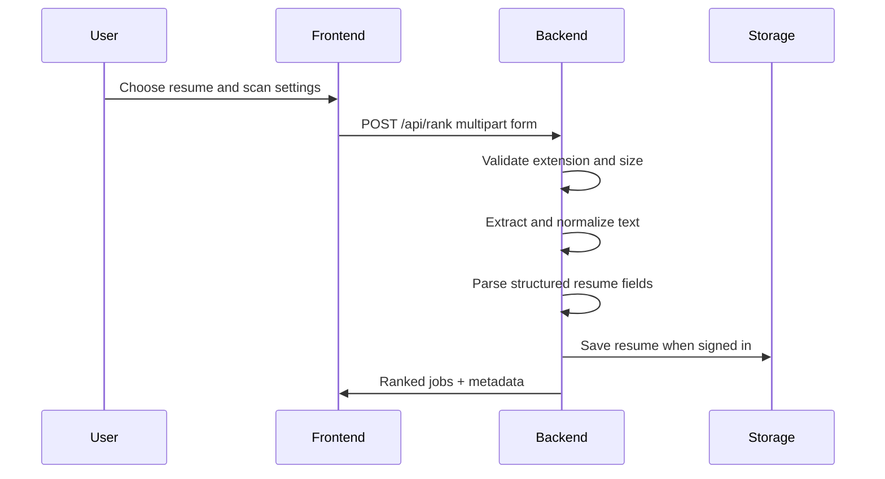
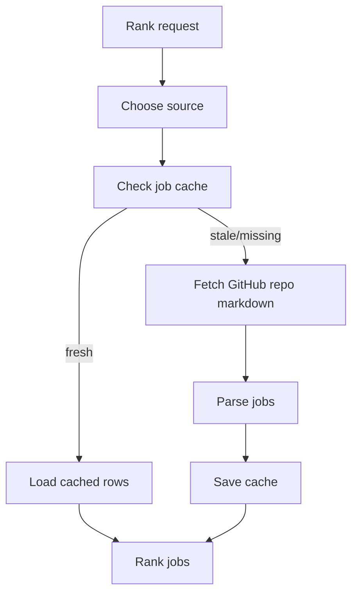
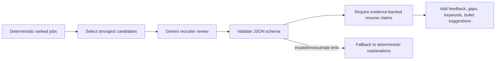

# JobFIT Architecture

## Production Shape

JobFIT is split into three active parts:

1. **Next.js frontend** in `frontend/` for the user interface.
2. **FastAPI backend** in `backend/` for resume parsing, job ingestion, ranking, Gemini recommendations, and account data APIs.
3. **Supabase** for hosted Auth and storage, with SQLite as a local fallback.

Default hosted target:

```text
Amplify frontend -> Railway FastAPI backend -> Supabase Auth/Postgres/Storage-style tables
```

AWS ECS work is archived in `legacy/deployment-experiments/` so it can be revived later without confusing the current production path.

## Resume Upload Flow



Important behavior:

- Accepted types: `.pdf`, `.docx`, `.txt`.
- Default max file size: 5 MB via `JOBFIT_MAX_RESUME_BYTES`.
- Raw resume text is used for matching but is never written to logs.
- Structured resume data is returned as `resumeStructured`.

## Job Cache Flow



The default source is `All job repos`, which scans all configured SimplifyJobs and Jobright sources. The cache TTL is controlled by `JOBFIT_JOB_CACHE_TTL_MINUTES`.

## Matching Flow

The deterministic matcher ranks every job using:

- Resume/job keyword similarity.
- Skill overlap.
- Role title match.
- Location preference.
- Job freshness.

The matcher intentionally does most scoring without AI so the product remains fast, explainable, and cheaper to run.

## Gemini Recommendation Flow

Gemini is optional and scoped to recommendation quality, not core availability.



Reliability behavior:

- Retries transient `429`, `5xx`, and timeout failures with short backoff.
- Validates JSON output before using it.
- Filters resume-bullet suggestions when the claimed source bullet is not present in the resume text.
- Tracks `aiProvider`, `aiCostEstimate`, `latencyMs`, warnings, reviewed counts, and enhanced counts in API responses.

## Account And Saved Job Flow

Signed-in users can:

- Store resume records.
- Reuse saved resumes.
- Save, apply, skip, and unsave job matches.
- View previous match runs.
- Delete individual resumes.
- Delete the full account and associated JobFIT data.

Supabase Auth is the production direction. The backend still supports the original custom account/session tables as a compatibility layer while the migration is completed.

## Privacy And Logging

The backend logs:

- Request ID.
- Endpoint.
- HTTP method.
- Status code.
- Latency.
- Error type.

The backend must not log:

- Raw resume text.
- Uploaded file contents.
- Passwords.
- API keys.
- Supabase service-role keys.
- Gemini prompts containing private resume content.
